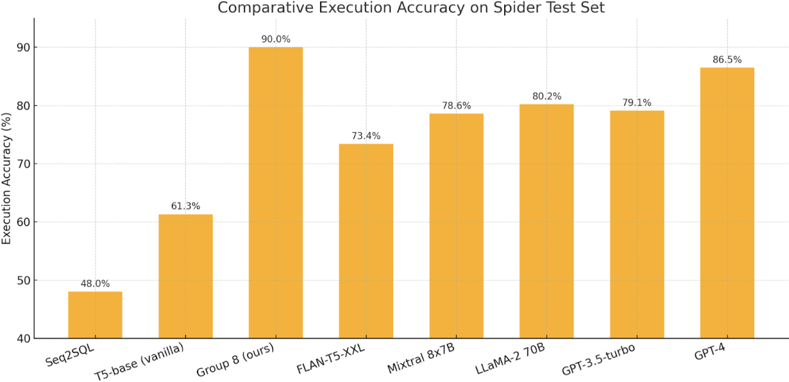
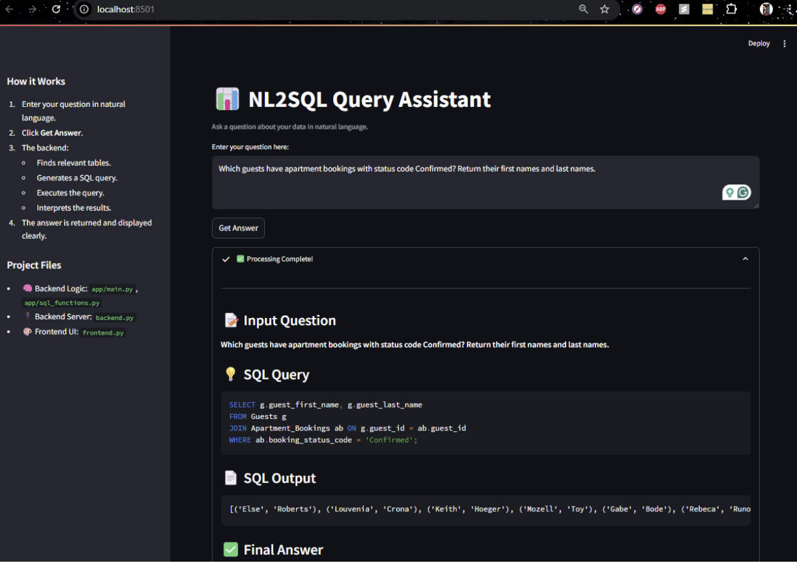

## 📸 Demo Screenshots

### 1️⃣ Model Benchmark Results
Execution accuracy comparison of various models on the Spider test set:


### 2️⃣ NL2SQL Query Assistant – Home Screen
Main UI for entering natural language questions and retrieving SQL answers:


### 3️⃣ Sample Query Execution
Example query showing generated SQL and the final answer:


# 🧠 Natural Language-to-SQL Copilot

Natural Language-to-SQL Copilot helps users convert natural language questions into SQL queries, execute them on real databases, and interpret the results. It removes SQL as a barrier to insights using AI-driven query generation and analysis.

Add demo in future

---

## 🚀 Features

- Natural language input → SQL query generation
- Automatic schema recognition via vector search
- Query validation, execution, and result interpretation
- FastAPI backend + Streamlit frontend
- Powered by OpenAI or HuggingFace models (like `flan-t5-xxl`)
- Built on top of the Spider benchmark dataset

---

## 🗂️ Project Structure

```
NL2SQL/
├── .env
├── requirements.txt
├── setup.py
├── README.md
├── src/
│   ├── app/
│   │   ├── backend.py       # FastAPI backend
│   │   ├── frontend.py      # Streamlit frontend
│   │   ├── main.py          # Core SQL Copilot logic
│   │   ├── sql_functions.py # DB logic, embedding, SQL generation
│   │   └── test.py          # Optional test runner
│   └── data/
│       └── raw/             # Place Spider dataset here
│
└── venv/                    # Python virtual environment (optional)
```

---

## 📦 Installation & Setup

### 1. 📁 Get the Dataset

This project is designed for the [Spider](https://yale-lily.github.io/spider) benchmark dataset.

Download and setup:

```bash
# Step 1: Download
wget --content-disposition "https://drive.google.com/uc?export=download&id=1TqleXec_OykOYFREKKtschzY29dUcVAQ"

# Step 2: Unzip
unzip spider.zip

# Step 3: Move it under src/data/raw/
mv spider src/data/raw/
```

---

### 2. 🛠️ Install Dependencies

```bash
pip install -r requirements.txt
```

---

### 3. 🧠 Vector Database Setup

Build ChromaDB embeddings from your Spider dataset:

```bash
python setup.py
```

This will index all database schemas and sample data. It may take 10–15 minutes.

---

## 🔐 HuggingFace / OpenAI API Key

Create a `.env` file in the root directory:

```bash
touch .env
```

Add the following:

```
hf_token=your_huggingface_api_key
OPENAI_API_KEY=your_openai_key_if_used
```

---

## 🧪 Running the Application

### ✳️ Run Backend (FastAPI)

```bash
cd src/app
uvicorn backend:app --reload --host 0.0.0.0 --port 8000
```

### 🎨 Run Frontend (Streamlit)

In a new terminal:

```bash
cd src/app
streamlit run frontend.py
```

Then open: [http://localhost:8501](http://localhost:8501)

---

## ✏️ Example Workflow

1. Open the frontend UI.
2. Enter a question like:  
   _“How many heads of the departments are older than 56?”_
3. It will:
   - Find relevant schemas
   - Generate a SQL query
   - Execute the query
   - Return a clean, formatted answer

---

## 📝 Citation & Acknowledgements

- **LangChain**  
  Chase, H. (2022). [LangChain GitHub](https://github.com/hwchase17/langchain)

- **Spider Dataset**  
  Yu, T., et al. (2018). Spider: A large-scale human-labeled dataset for complex and cross-domain semantic parsing. [arXiv:1809.08887](https://arxiv.org/abs/1809.08887)

---


